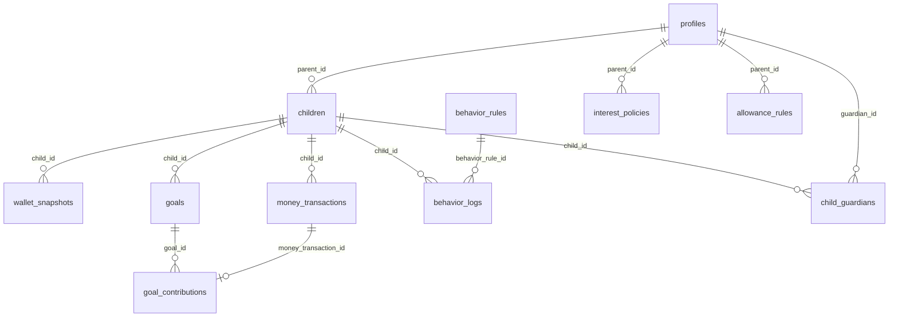

# MONARI PRODUCT STRATEGY V3
## 어린이·청소년 Family Financial Platform 전면 재기획

> **작성일**: 2026-08-28  
> **상태**: 대표 검토 및 승인 대기  
> **다음 단계**: 대표 승인 후 구현 계획 수립

---

# PART 1: Current Product Audit

## 현재 Monari를 한 문장으로 정의

> **"이자율 게임화를 핵심으로 한 부모 주도 용돈 관리 도구로, 아이 화면이 있지만 실질적으로 아이가 자발적으로 사용할 이유가 약한 앱"**

## 현재 구현 완료 기능 (실제 작동 기준)

| 기능 | 완성도 | 비고 |
|---|---|---|
| 부모 이메일 로그인/회원가입 | ✅ 완료 | Supabase Auth |
| 아이 등록 + PIN 인증 | ✅ 완료 | scrypt 해시, 5회 실패=15분 잠금 |
| 정기 용돈 (주간/월간) | ✅ 완료 | Edge Function 자동 실행 |
| 즉시 용돈 지급 | ✅ 완료 | 부모→아이 즉시 |
| 행동약속 등록/승인 | ✅ 완료 | 사진 첨부 포함 |
| 행동약속 → 이자율 연동 | ✅ 완료 | 가장 독창적인 기능 |
| 저금 (수동) | ✅ 완료 | 아이 직접 저금 실행 |
| 현금 사용 기록 + 부모 승인 | ✅ 완료 | |
| 미리쓰기 (선용돈) 요청/상환 | ✅ 완료 | 할부 상환 포함 |
| 월별 이자 정산 | ✅ 완료 | Edge Function |
| 또래 비교 인프라 | ✅ 완료 | 나이대별 집계, 지역 포함 |
| 금융 건강 점수 (0-100) | ✅ 완료 | 리포트 페이지 |
| 소비성향 유형 (5가지) | ✅ 완료 | |
| 월간 리포트 | ✅ 완료 | Plus 일부 잠금 |
| 공동 보호자 초대/관리 | ✅ 완료 | 6가지 권한 설정 |
| 알림 (인앱) | ✅ 완료 | |
| 웹 푸시 등록 | ✅ 완료 | 실제 발송 부분 구현 |
| 구독 (Plus) 결제/관리 | ✅ 완료 | PortOne 빌링키 |
| 구독 자동 갱신 | ✅ 완료 | 2026-08-28 구현 완료 |
| 관리자 대시보드 | ✅ 완료 | 30+ 어드민 페이지 |
| 카드 UI/관리 화면 | ✅ 완료 | UI만 |

## 부분 구현 또는 미작동 기능

| 기능 | 상태 | 문제 |
|---|---|---|
| 카드 발급/결제 | ⚠️ UI만 완성 | partner = 'mock', 실제 카드사 연결 없음 |
| 실제 Wallet 충전 | ⚠️ 부분 | PortOne 결제 코드 있지만 실환경 미검증 |
| 목표 저축 | ⚠️ 미완성 | **별도 목표 테이블 없음**, 30% 하드코딩 |
| 웹 푸시 실발송 | ⚠️ 부분 | 라이브러리 있지만 서버 키 설정 불명확 |
| 지역 히트맵 | ⚠️ 부분 | 사용자가 지역 설정해야 작동, 데이터 부족 |
| 또래 비교 실데이터 | ⚠️ 부분 | 인프라 완성, 사용자 수 충분해야 유효 |
| behavior_based 용돈 | ⚠️ 미사용 | enum에 있지만 UI 없음 |

## 현재 구조가 새 Vision과 일치하는 정도

| 새 Vision 항목 | 현재 일치도 | 갭 |
|---|---|---|
| 아이 첫 금융생활 플랫폼 | 40% | 아이가 자발적으로 쓸 이유 약함 |
| Family Financial Network | 30% | 부모1↔아이N만, 조부모/확장가족 없음 |
| 실제 Wallet | 20% | 가상 잔액만, 충전/출금 미완성 |
| 카드 | 10% | UI만, 실물 없음 |
| 친구 송금/네트워크 | 0% | 완전 미구현 |
| 목표 저축 시스템 | 20% | 30% 고정, 목표 테이블 없음 |
| Money Score | 70% | 금융 건강 점수로 구현됨, 고도화 필요 |
| 또래 벤치마크 | 60% | 인프라 완성, 데이터 확보 필요 |
| AI Coaching | 0% | 미구현 |
| 연령별 UX | 10% | 단일 아이 화면 |

## 향후 확장을 막을 수 있는 구조적 문제

1. **목표 저축 테이블 부재**: `goals` 테이블이 없어 "Nintendo Switch 모으기" 같은 실제 목표 저축 구현 불가. 30% 하드코딩은 근본적으로 다시 설계해야 함.
2. **Family 구조 단순**: `children.parent_id` = 단일 부모. 다부모/재혼/조부모 구조 수용 불가.
3. **Transaction type 확장성**: `money_transactions.type` enum이 고정값. 새 거래 유형 추가 시 DB 마이그레이션 필요.
4. **아이 Profile 분리 미흡**: `children` 테이블이 `profiles`와 분리되어 있어 아이가 독립 계정을 갖는 구조로의 전환이 어려움.
5. **단일 통화/단일 국가 가정**: KRW 하드코딩, 국제화 구조 없음.

---

# PART 2: Competitive Gap Analysis

## 토스 / 토스 유스카드

| 항목 | 토스의 성공 이유 | Monari 적용 여부 |
|---|---|---|
| 잔액 확인 즉시성 | 앱 열자마자 잔액이 보임 | ✅ 적용 가능, 아이 홈 상단 |
| 간편 송금 | 3탭이내 완료 | ❌ 미구현 (Phase 4) |
| 카드 잠금/해제 | 즉시 토글 | ⚠️ UI 있지만 실카드 없음 |
| "내 돈"이라는 감각 | 아이가 자신의 계좌처럼 느낌 | ⚠️ 현재 Monari는 부모 통제 느낌 강함 |
| 알림 즉시성 | 거래 즉시 푸시 | ⚠️ 현금 승인 구조상 딜레이 있음 |
| 친구 네트워크 | 더치페이, 친구 송금 | ❌ 없음 |

**핵심 학습**: 아이가 "내 금융앱"이라고 느끼게 만드는 것이 Retention의 핵심.  
**Monari 적용**: 아이 Home을 부모 관리보조 화면이 아닌, 아이 중심 Wallet 화면으로 재설계.

---

## 카카오뱅크 mini

| 항목 | mini의 성공 이유 | Monari 적용 여부 |
|---|---|---|
| 실물 카드 (mini 카드) | "내 카드"라는 소유감 | ❌ 미구현 |
| 저금통 | 목표별 저금 | ❌ 목표 테이블 없음, **MVP Priority** |
| ATM 출금 | 실제 돈 인출 가능 | ❌ 실물 인프라 필요 |
| 카드 디자인 선택 | 아이 정체성 표현 | ❌ 미구현 |
| 교통 기능 | 일상 생활 접점 | ❌ Phase 3 이후 |
| 쉬운 가입 | 7세부터 부모 동의 | ✅ Monari도 부모 주도 가입 |

**핵심 학습**: 실물 카드 1장이 앱을 "살아있는 금융도구"로 만듦.  
**Monari 적용**: Phase 3에서 BaaS 파트너를 통해 실물 카드 도입 필수.

---

## 아이부자 (하나은행)

| 항목 | 아이부자의 성공 이유 | Monari 적용 여부 |
|---|---|---|
| 부모↔아이 연결 | 가족 단위 가입 | ✅ 구현됨 |
| 용돈 보내기 | 즉시 전송 | ✅ 구현됨 |
| 정기 용돈 | 자동 지급 | ✅ 구현됨 |
| 미션 보상 | 행동→보상 | ✅ 구현됨 (더 정교함) |
| 은행 계좌 연동 | 실제 돈 움직임 | ❌ Monari는 가상 잔액 |
| 가족 참여 | 할머니도 용돈 보내기 | ❌ Monari는 공동보호자만 |

**아이부자 대비 Monari 강점**: 행동→이자율 시스템, 미리쓰기/상환, 또래비교, 금융습관 리포트.  
**아이부자 대비 Monari 약점**: 실제 돈 이동 불가, 확장 가족 참여 없음.  
**핵심 학습**: 아이부자의 성공은 "실제 돈이 움직인다"는 신뢰감. Monari Phase 2에서 실물 연동 필수.

---

## 퍼핀 (핀크)

| 항목 | 퍼핀의 성공 이유 | Monari 적용 여부 |
|---|---|---|
| 부모 2명 동시 관리 | 맞벌이/공동 육아 | ✅ 공동보호자로 구현됨 |
| 다자녀 통합 관리 | 형제 동시 관리 | ✅ 부모 홈에서 여러 아이 관리 |
| 선불카드 | 실물 카드 | ❌ 없음 |
| 용돈 한도 설정 | 소비 제어 | ⚠️ 카드 한도 UI만 있음 |

**핵심 학습**: 다자녀 가족의 Pain Point를 해결한 것이 퍼핀 차별점.  
**Monari 적용**: 다자녀 통합 리포트, 형제간 비교 기능은 Plus 기능으로 추가 가치 창출 가능.

---

## Npay 10대 / KB 스타틴즈 / 우리틴틴

**공통 관찰**: 이들은 기존 금융사의 청소년 버전으로, "어른 금융앱의 소형화". 금융교육보다 결제 편의에 집중.

**Monari 포지션**: Npay/KB는 청소년(14세+) 타겟. Monari는 초등학생(7-13세)이 핵심 타겟이어야 함. 청소년 확장은 Phase 4 이후.

**핵심 학습**: Npay의 포인트 리워드, 친구 더치페이 같은 기능은 청소년 Retention에 강력. 단, 초등학생에게는 복잡함. 연령 분기 설계 필수.

---

## 경쟁사 종합 갭 매트릭스

| 기능 | Toss | Kakao mini | 아이부자 | 퍼핀 | Monari 현재 | Monari 목표 |
|---|---|---|---|---|---|---|
| 실물 카드 | ✅ | ✅ | ❌ | ✅ | ❌ | Phase 3 |
| 실제 송금 | ✅ | ✅ | ✅ | ✅ | ❌ | Phase 4 |
| 행동→이자율 | ❌ | ❌ | 일부 | ❌ | ✅ | **Core** |
| 금융습관 분석 | ❌ | ❌ | 일부 | ❌ | ✅ | **Core** |
| 또래 비교 | ❌ | ❌ | ❌ | ❌ | ✅ | **Core** |
| 목표 저축 | 일부 | ✅ | ❌ | ❌ | ⚠️ | MVP 필수 |
| 가족 네트워크 | ❌ | ❌ | ✅ | ✅ | ⚠️ | Phase 2 |
| AI 코칭 | ❌ | ❌ | ❌ | ❌ | ❌ | Phase 5 |

---

# PART 3: New Product Positioning

## 브랜드 포지셔닝

> **"아이의 첫 금융생활을 가족이 함께 만드는 플랫폼"**

- 경쟁사 대비 차별점: 금융도구가 아니라 **금융습관 형성 플랫폼**
- 부모에게: "아이가 돈을 어떻게 쓰는지 보여주는 앱"이 아니라 "아이의 금융습관이 성장하는 것을 함께 경험하는 앱"

## Product 포지셔닝

Option D 추천: **"가족이 함께 만드는 아이의 첫 금융생활"**

이유: Option A("첫 금융생활 플랫폼")는 카카오 mini/토스와 충돌. Option D는 **가족 연결**을 강조해 아이부자/퍼핀과도 차별화되면서, Monari만의 **습관 형성** 포지션 유지 가능.

## 경쟁 포지셔닝 맵

```
          [금융교육 중심]
               ↑
    아이부자   Monari(목표)
               |
[가족 참여] ←——+——→ [아이 자율]
               |
    Kakao mini  Toss
               ↓
          [결제/편의 중심]
```

Monari는 우측 상단(아이 자율 + 금융교육)을 지향해야 함. 현재는 좌측 상단(가족 참여 + 금융교육)에 위치.

---

# PART 4: Target Persona

## Persona 1: 초등 저학년 아이 (7-9세) — "나는이"

- 용돈 5,000-10,000원/주
- 목표: 문구, 캐릭터 굿즈, 간식
- 앱 사용: 부모 도움으로 시작, 미션 체크 위주
- Pain: 돈 개념 없음, 충동 소비
- 원하는 것: 게임 같은 경험, 캐릭터, 보상
- Monari에서 필요한 것: 쉬운 미션 체크, 저금 게이지, 부모 칭찬

## Persona 2: 초등 고학년 아이 (10-13세) — "지호"

- 용돈 20,000-50,000원/월
- 목표: 게임, 배달음식, 친구와 활동
- 앱 사용: 혼자 사용 가능, 잔액 확인 자주
- Pain: 용돈이 금방 없어짐, 부모 잔소리
- 원하는 것: 자율성, "내 돈이라는 느낌", 친구와 함께
- Monari에서 필요한 것: 카드 느낌의 Wallet, 목표 저축, Money Score

## Persona 3: 중학생 (14-16세) — "서준"

- 용돈 50,000-100,000원/월
- 목표: 옷, 게임 아이템, 친구 약속
- 앱 사용: 매우 자율적, 부모 개입 싫어함
- Pain: 친구와 돈 계산이 어색함, 자산 관리 개념 없음
- 원하는 것: 일반 금융앱 수준의 UX, 송금, 더치페이
- Monari에서 필요한 것: 친구 송금, 소비 분석, 간단한 예산

## Persona 4: 주 보호자 부모 (35-45세) — "민주씨"

- 자녀 1-2명
- 목표: 아이 용돈 관리 편의 + 금융교육
- 앱 사용: 용돈 줄 때, 미션 승인할 때, 리포트 볼 때
- Pain: 아이가 돈을 어디 쓰는지 모름, 직접 금융교육 어떻게 해야 할지 모름
- 원하는 것: 투명한 소비 확인 + 아이가 자발적으로 관리하길
- Monari에서 필요한 것: 간단한 용돈 설정, 리포트, 행동 연결

## Persona 5: 조부모 (60-70세) — "외할머니"

- 손자/손녀에게 용돈 주고 싶음
- 앱 사용 능력 낮음, 카카오톡 수준
- Pain: 직접 주면 부모가 뺏을까봐 걱정, 어떻게 쓰는지 알고 싶음
- 원하는 것: 간단하게 용돈 보내기 + 사용처 확인
- Monari에서 필요한 것: 1탭 내 용돈 보내기, 간단한 확인

---

# PART 5: Jobs To Be Done

## 아이 JTBD

1. "용돈 잔액이 얼마인지 바로 확인하고 싶다" → Wallet Home
2. "목표한 물건을 언제 살 수 있는지 알고 싶다" → Goal Progress
3. "오늘 미션을 끝냈다는 걸 기록하고 싶다" → Behavior Check
4. "돈이 부족할 때 부모에게 쉽게 요청하고 싶다" → 미리쓰기
5. "(중학생) 친구에게 빌린 돈을 돌려주고 싶다" → 송금

## 부모 JTBD

1. "용돈을 정기적으로 자동으로 주고 싶다" → 정기용돈 설정
2. "아이가 미션을 완료했는지 확인하고 싶다" → 승인함
3. "아이의 금융습관이 좋아지고 있는지 알고 싶다" → 리포트
4. "할머니가 용돈을 직접 줄 수 있게 하고 싶다" → Family 초대
5. "아이에게 돈 이야기를 어떻게 해야 할지 모르겠다" → Parent Coaching

## 조부모 JTBD

1. "손자에게 용돈을 보내고 싶다" → 간단한 용돈 보내기
2. "선물한 돈이 잘 쓰이는지 확인하고 싶다" → 간단한 알림

---

# PART 6: Financial Growth Loop

Monari의 핵심 Core Loop:

```
[1] FAMILY SETUP
부모가 아이 등록 + 행동약속 설정 + 정기용돈 설정
         ↓
[2] ALLOWANCE
자동/즉시 용돈 지급 → 아이 Wallet에 반영
         ↓
[3] CHILD ACTION
아이가 미션 체크 + 저금 + 목표 진행
         ↓
[4] SPEND & RECORD
실제 소비 기록 (카드/현금) → 카테고리 자동 분류
         ↓
[5] REWARD
미션 달성 → 보상 지급 + 이자율 상승
목표 달성 → 축하 + 다음 목표 설정
         ↓
[6] ANALYZE
월말 → 금융 건강 점수 + 소비 패턴 + 또래 비교
         ↓
[7] FEEDBACK
아이: Money Score 변화 + 이달의 한 문장
부모: 리포트 + Parent Coaching Tip
         ↓
[8] NEXT CYCLE
다음 달 목표 설정 + 미션 조정 + 용돈 결정
         ↓
[1]으로 반복
```

**Loop의 핵심 동력**: 행동(미션) → 이자율 변화 → Money Score 변화 → 아이와 부모 모두 변화를 체감 → 앱을 계속 열 이유 생성.

---

# PART 7: Family Financial Network

## 현재 구조 문제

현재: `children.parent_id` (단일 부모) + `child_guardians` (공동보호자)  
문제: 조부모가 용돈을 보내려면 반드시 공동보호자가 되어야 함 → 과도한 권한 부여.

## 추천 Family Role 구조

### Primary Guardian (주 보호자)
- 가족 생성 + 자녀 등록
- 모든 용돈/미션/카드/설정
- 가족 초대 + 권한 관리
- 현재 구현에서 `parent_id` 보유자

### Secondary Guardian (공동 보호자)
- 현재 `child_guardians` 테이블로 구현 완료
- 6가지 권한 비트 (`can_give_allowance`, `can_approve_behavior` 등)
- **개선 필요**: 현재는 공동보호자가 가족 전체 또는 특정 아이에게만 연결되는데, 이를 명확히 UI로 표현해야 함

### Gift Giver (선물 기여자, 신규)
- 조부모, 친척 대상
- 권한: 용돈 보내기 + 목표 후원만
- 소비 내역 접근 제한
- 등록: 카카오/문자 초대 링크 (앱 설치 불필요, 웹뷰로 처리)
- DB: 별도 `gift_givers` 테이블 또는 `child_guardians`에 role 컬럼 추가

### Child (아이)
- 자신의 Wallet + 카드 + 소비 + 저축 + 목표

## Family Invite UX

```
[부모 앱]
"가족 초대" → 역할 선택 (공동보호자/선물기여자)
→ 연락처 선택 또는 링크 복사
→ 7일 유효 토큰 (현재 guardian_invites 활용)

[조부모 입장]
카카오 링크 클릭 → 웹뷰 (앱 설치 불필요)
→ 이름 입력 + 전화번호 인증
→ "손자에게 용돈 보내기" 화면 진입
```

## Edge Cases

| 상황 | 처리 방안 |
|---|---|
| 부모 이혼/별거 | Primary Guardian 변경 가능 (관리자 개입 또는 현 Primary 동의) |
| 재혼 가정 | 새 부모를 Secondary Guardian으로 추가 |
| 보호자 사망 | 관리자 개입 채널 필요, 자동 처리 불가 |
| 조부모가 잘못된 가족에 초대됨 | 24시간 내 취소 가능 |
| 아이 성인(만 18세) | 독립 계정 전환 알림 + 가족 연결 해제 옵션 |
| 아이 탈퇴 | 트랜잭션 보존 (법적 의무), 개인정보 삭제 분리 처리 |
| Primary Guardian 탈퇴 | Secondary Guardian 승격 또는 서비스 종료 처리 |

## 솔직한 평가: 조부모 기능이 필요한가?

**찬성 근거**:
- 한국 문화에서 조부모의 손자녀 용돈은 매우 일반적
- "할머니가 준 돈이 Monari에 들어왔어요" 알림 → 아이 Retention 강화
- Family 참여 확대 → 가족 내 바이럴 효과

**반대 근거**:
- 조부모가 앱/링크 조작에 어려움을 겪을 가능성
- UX 복잡도 증가
- 실제 구현하면 고객지원 문의 증가

**추천**: Gift Giver 기능은 **Phase 2** 구현. MVP에서는 공동보호자(Secondary Guardian)만으로 충분. 단, DB 구조는 미리 설계.

---

# PART 8: Allowance System

## 현재 용돈 종류 (구현 완료)

1. **정기용돈** (weekly/monthly): Edge Function 자동 실행 ✅
2. **즉시용돈**: 부모 직접 지급 ✅
3. **행동 보상**: 미션 승인 시 자동 지급 ✅

## 추가 필요한 용돈 종류

4. **목표 후원 (Goal Sponsorship)**
   - 아이의 특정 목표를 조부모/부모가 후원
   - 목표 테이블 신설 후 구현 가능
   - "할머니가 Nintendo 목표에 20,000원 후원하셨어요"

5. **축하금 (Gift Money)**
   - 생일/명절/입학 등 특별 용돈
   - 카테고리: `gift` type 추가
   - Gift Giver 역할과 연동

## 돈 출처 시각화

아이 Wallet에서:

```
이번 달 받은 돈 108,000원

엄마 정기용돈  30,000 ███░░
아빠 즉시용돈  20,000 ██░░░
할머니 생일   50,000 █████
미션 보상      8,000 █░░░░
```

**구현 방법**: `money_transactions`에 `given_by` (UUID) 컬럼 추가. 현재 `created_by` 컬럼이 있으나 출처 구분 용도로 명시 강화 필요.

## 용돈 받기 → 배분 UX

```
"아빠가 30,000원을 보내셨어요!"

[지금 어떻게 나눌까요?]
사용    20,000원  [조정 가능]
저금    8,000원
목표 기여 2,000원

[이대로 받기]  [직접 설정]
```

**중요**: 강제 배분이 아닌 선택. 아이가 직접 바꿀 수 있어야 함.  
**구현 복잡도**: 중간. `allowance_distribution_preset` 테이블 신설 필요.  
**MVP 포함 여부**: No. Phase 2 이후.

---

# PART 9: Wallet

## 현재 구조 (wallet_snapshots)

```
balance          - 전체 잔액
savings_balance  - 저금 잔액
borrowed_balance - 미리쓰기 잔액
```

**문제**: "사용 가능 잔액"이 `balance - savings_balance - borrowed_balance`로 계산되지만, 별도 컬럼이 없어 UI에서 매번 계산.

## 추천 Wallet Bucket 구조

```
[내 돈 52,500원]
┌─────────────────────────────────┐
│ 💳 사용 가능    27,500원  52%   │ ← Spend Bucket
│ 🏦 저금        15,000원  29%   │ ← Save Bucket  
│ 🎯 목표        10,000원  19%   │ ← Goal Bucket (신규 필요)
└─────────────────────────────────┘
```

**Goal Bucket**: 현재 미구현. `goals` 테이블 신설 + `wallet_snapshots.goals_balance` 컬럼 추가 필요.

## Wallet Home 우선 설계 원칙

1. 잔액이 가장 크게 보여야 함 (현재 ✅)
2. 사용 가능 잔액이 저금과 명확히 구분되어야 함
3. 목표 진행률이 잔액 바로 아래에 보여야 함 (현재 별도 섹션으로 분리됨)
4. "이번 달 남은 예산" 개념 추가 (월 예산 설정 시)

---

# PART 10: Card

## 현재 상태

- `card_applications`, `child_cards`, `card_transactions` 테이블 완비
- `partner = 'mock'` 하드코딩
- 카드 UI 완성 (신청/관리/한도/분실)
- 실제 카드 발급/결제 연동 없음

## 금융 인프라 옵션 비교

| 방법 | 비용 | 기간 | 규제 | 난이도 | 추천 |
|---|---|---|---|---|---|
| A. 직접 인프라 | 수십억 | 2년+ | 전자금융업 등록 필요 | 매우 높음 | ❌ |
| B. 은행 제휴 | 협의 | 6-18개월 | 은행 리스크 정책 적용 | 높음 | Phase 3 후보 |
| C. 카드사 제휴 | 협의 | 6-12개월 | 복잡 | 높음 | Phase 3 후보 |
| D. BaaS 업체 제휴 | 월정액+거래당 | 2-4개월 | 업체가 라이센스 보유 | 중간 | **✅ 추천** |
| E. 가상 Wallet → 이후 연결 | 낮음 | 즉시 가능 | 없음 | 낮음 | **Phase 1-2** |

**BaaS 후보 (한국)**:  
- 핀테크 BaaS: 브랜드페이, 갤럭시아머니트리, 핀셋N  
- 선불전자지급: 한국선불카드, KT M하우스  
- *주의*: 정확한 제휴 조건/비용은 직접 협의 필요. 법적 사항은 별도 법무 검토 필수.

**추천 로드맵**:
- Phase 1-2: 가상 Wallet (현재 구조) → 부모 충전 기능 강화
- Phase 3: BaaS 업체를 통한 선불카드 발급
- 실물 카드 신청 UI는 이미 준비됨 → 파트너 연결만 하면 됨

## Card UX 원칙

- 초등 저학년: 캐릭터 카드 디자인 선택 가능
- 초등 고학년: 심플한 컬러 카드
- 중학생: 일반 카드 디자인 (카카오뱅크 느낌)
- 카드가 "부끄럽지 않은 디자인"이어야 함

---

# PART 11: Transfer & Friends

## 솔직한 평가

**지금 당장 필요한가?**: No.  
**장기적으로 필요한가?**: Yes, 중학생 Retention을 위해서.

**찬성 근거**: 친구 더치페이, 송금은 10대의 가장 강한 Financial Behavior. 이것 없이는 중학생이 Toss로 떠남.

**반대 근거**:
- 전자금융거래법상 미성년자 간 송금에는 법적 제약 가능 (법무 검토 필수)
- 실카드/실Wallet 없이 송금은 의미 없음
- Phase 4 이전에는 구현 불가 (선결 조건: 실물 Wallet)

## 추천 도입 순서

Phase 4 이후, 실물 Wallet 구축 후 검토.  
법적 사항 확인 필요: 미성년자 간 전자송금의 부모 동의 요건.

## Friend Network Privacy 원칙

- 친구의 자산/용돈 수준 절대 노출 금지
- 송금 내역은 본인만 확인
- 친구 검색: 전화번호 해시로만 (직접 번호 미노출)

---

# PART 12: Saving & Goal

## 현재 구조의 가장 큰 문제

**`goals` 테이블이 없다.** 저금 목표가 30% 하드코딩.

이것은 MVP에서 반드시 해결해야 할 가장 큰 기능 갭이다.

## 추천 Goal 시스템

```sql
-- 신규 테이블
CREATE TABLE goals (
  id UUID PRIMARY KEY,
  child_id UUID REFERENCES children(id),
  title TEXT NOT NULL,           -- "Nintendo Switch Game"
  target_amount BIGINT NOT NULL, -- 70000
  current_amount BIGINT DEFAULT 0, -- 42000 (저금 중 일부를 배정)
  deadline DATE,                 -- NULL 가능
  image_url TEXT,                -- 아이가 고른 이미지
  status TEXT DEFAULT 'active',  -- active/achieved/cancelled
  created_at TIMESTAMPTZ,
  achieved_at TIMESTAMPTZ
);

CREATE TABLE goal_contributions (
  id UUID PRIMARY KEY,
  goal_id UUID REFERENCES goals(id),
  contributor_id UUID,           -- 아이 or 부모 or Gift Giver
  amount BIGINT,
  money_transaction_id UUID,
  memo TEXT,
  created_at TIMESTAMPTZ
);
```

## Goal UX

```
[새 목표 만들기]
1. 이름 입력: "Nintendo Switch 게임"
2. 금액: 70,000원
3. 사진: 🎮 (이모지 or 검색)
4. 목표일: 9월 30일 (선택)

→ "매주 5,000원씩 저금하면 9월 30일에 달성해요!"

[목표 진행 중]
Nintendo Switch 게임
[████████░░] 60% · 42,000/70,000
예상 달성: 18일 후

Monari: "이번 주 3,000원을 더 저금하면 12일 앞당길 수 있어요"
```

## 행동 피드백 원칙

- 소비를 "나쁜 행동"으로 판단하지 않는다
- "오늘 간식을 즐겼어요. 목표까지 28,000원 남았어요" ← Good
- "간식을 또 샀네요. 목표가 멀어지고 있어요" ← Bad

---

# PART 13: Money Score

## 현재 구현 (금융 건강 점수)

```
저축률      35%
행동달성률   40%
이자 수령    10%
미리쓰기 없음 15%
= 100점
```

**문제점**:
1. "미리쓰기 없음"이 감점 요소 → 미리쓰기가 나쁜 것이라는 인식 심어줄 수 있음
2. 저축률 35% 과다 배점 → 돈을 많이 받은 아이가 유리
3. 미션 달성 이외의 행동(앱 사용 패턴, 목표 설정 등)이 미반영

## 추천 Money Score 개편

```
[계획성]       25점
  └ 용돈 받은 후 배분 설정 여부
  └ 월 예산 범위 내 소비
  └ 소비 기록 꾸준히 남김

[저축습관]     25점
  └ 저금 행동 지속성 (금액 아닌 행동 횟수)
  └ 목표 설정 및 진행 여부

[목표관리]     25점
  └ 목표 생성 후 포기 안 함
  └ 목표 달성률
  └ 다음 목표 설정

[꾸준함]       25점
  └ 미션 달성 연속성 (스트릭)
  └ 주간 앱 사용 지속성
  └ 월간 리포트 확인
```

**핵심 원칙**: 돈을 "많이 모으는" 아이가 아닌 "계획적으로 관리하는" 아이가 높은 점수를 받아야 함.

## 윤리적 고려

| 위험 | 대응 |
|---|---|
| 아이 간 점수 비교 → 열등감 | 친구와 점수 비교 기능 제공 금지 |
| 부모가 점수로 아이 압박 | 점수는 "성장 방향" 제시용, 채점 도구 아님을 UX로 강조 |
| 높은 점수 = 저축 많이 = 돈 많은 아이 유리 | 절대 금액이 아닌 비율/행동 패턴으로만 평가 |

---

# PART 14: Peer Benchmark

## 현재 구조

- `peer_stats` 테이블: 나이대별(7-9/10-13/14-16) + 지역별 주간 집계
- `aggregate-peer-stats` Edge Function으로 자동 집계
- `sample_size` 컬럼으로 최소 표본 수 기반 공개 여부 제어

## 초기 데이터 문제

사용자가 적은 초기에는 또래 비교 데이터가 없거나 부정확.

**잘못된 접근**: 가짜 데이터를 실제인 것처럼 제공.  
**올바른 접근**:
1. `sample_size < 30` 시 "아직 데이터가 충분하지 않아요" 메시지
2. 전국 데이터가 없으면 지역 데이터 숨김
3. 초기에는 "이번 달 저축률 목표를 직접 설정해보세요" 로 대체

## Privacy 원칙

- 최소 cohort size: 30명 (현재 `peer_stats` 집계 시 필터 확인 필요)
- 연령대만 사용, 개인 식별 없음
- "OO시 초등 4학년 평균"까지만 표시
- 개인 간 직접 비교 절대 금지

## Plus 기능으로서의 가치

또래 비교는 부모의 가장 강한 관심사. "우리 아이 저축률이 또래 평균보다 높다"는 정보는 강력한 Plus 전환 유도 도구.

**추천**: 또래 비교 기능의 미리보기(흐릿하게 표시)는 무료, 상세 데이터는 Plus 유지.

---

# PART 15: Parent Report

## 현재 리포트 구성

- 금융 건강 점수 (0-100)
- 소비성향 유형
- 이달의 한 문장
- 또래 비교
- 카테고리별 지출 (Plus)
- 지역 히트맵 (Plus)

## 추가 필요한 리포트 요소

### 주간 요약 (신규)

```
📊 이번 주 지호의 금융생활
미션 4/5개 달성 (저번 주: 3/5)
저금 5,000원 (목표의 83%)
소비 12,000원 (예산 내)

💡 이번 주 대화 팁:
"미션 달성이 늘었어요. '어떤 미션이 제일 좋았어?'라고 물어보세요."
```

### Parent Coaching 강화

현재 "이번 주 대화 질문 카드"가 있지만 고정 문장. 아이의 실제 데이터 기반 개인화 필요.

```
현재: "이번 주 용돈을 어디에 쓰고 싶어?"
개선: "지호가 이번 달 저금을 전달보다 40% 더 했어요. '어떻게 더 저금할 수 있었어?'라고 물어보세요."
```

### 성장 트렌드 (Plus)

- Money Score 6개월 추이 그래프
- 저축률 변화
- 미션 달성률 변화
- "6개월 전보다 저축습관이 많이 좋아졌어요"

---

# PART 16: Child UX

## 현재 아이 홈의 문제

현재 아이 홈 구성:
1. 잔액 (큰 텍스트) ✅
2. 이자율 + 예상이자 ⚠️ (아이에게 이자율이 중요한가?)
3. 연속 달성 스트릭 ✅
4. 오늘 약속 진행률 ✅
5. 약속체크/저금/이번달/현금 버튼 ✅
6. 이달 흐름 4카드 ⚠️ (너무 많은 숫자)
7. 저금 달성률 링 ✅
8. 또래 비교 ⚠️ (아이에게 또래 비교가 중요한가?)
9. 이번달 약속 달성률 ⚠️ (이미 상단에 있음, 중복)
10. 이자 미리보기 ❌ (아이에게 이자는 추상적)
11. 오늘의 금융 대화 팁 ❌ (부모용 콘텐츠가 아이 화면에)
12. 이자 리포트 카드 ❌

**핵심 문제**: 아이 화면이 부모의 관리 화면 축소판처럼 구성됨.

## 추천 아이 Home 재설계

```
[상단]
  아이 이름 + 날씨 느낌 인사 ("안녕 지호! 오늘도 화이팅!")
  
[Wallet]
  💳 내 돈  52,500원
  사용가능 27,500 / 저금 15,000 / 목표 10,000
  
[목표 (최우선 노출)]
  🎮 Nintendo Switch Game
  [████████░░] 42,000/70,000 · 18일 후!
  
[오늘 미션]
  ✅ 독서 30분     (+1,000원)
  □  방 청소       (+500원)   [체크하기]
  🔥 5일 연속 달성 중!
  
[빠른 액션]
  [저금하기]  [현금 기록]  [미리쓰기]
  
[이번 달]
  Money Score: 78 (↑3) 
  저축률: 27%  미션: 4/5
```

## 연령별 UX 분기

| 구분 | 7-9세 | 10-13세 | 14-16세 |
|---|---|---|---|
| 캐릭터 | ✅ 전면 사용 | 선택 가능 | ❌ 없음 |
| 이자율 표시 | ❌ 숨김 | ⚠️ 간단히 | ✅ 상세 |
| 또래 비교 | ❌ | ✅ 간단 | ✅ 상세 |
| 예산 기능 | ❌ | ✅ 기본 | ✅ 상세 |
| 소비 분석 | ❌ | ✅ 간단 | ✅ 상세 |
| 정보 밀도 | 낮음 | 중간 | 높음 |

**구현 방법**: `children.birth_year`로 나이 계산 → `age_stage` 결정 → 조건부 렌더링.

## 아이가 Monari를 열 이유 (Daily Return Reason)

강한 이유:
1. ✅ 목표 진행률 확인 ("게임 사려면 얼마 남았지?")
2. ✅ 오늘 미션 체크 (보상 받으러)
3. ✅ 잔액 확인 (돈 쓰기 전)

약한 이유 (강화 필요):
4. ⚠️ Money Score 변화 (주 1회 업데이트)
5. ⚠️ 할머니가 돈 보내셨다는 알림

제거해야 할 것:
- ❌ 이자 리포트 (아이가 관심 없음)
- ❌ 부모용 코칭 팁

---

# PART 17: Parent UX

## 부모가 Monari를 열 이유

1. **승인함**: 미션 승인, 현금 승인, 미리쓰기 승인 (현재 ✅)
2. **용돈 보내기**: 즉시 보내기 (현재 ✅)
3. **주간 리포트**: 이번 주 아이 요약 (부분 구현)
4. **목표 후원**: "아이 목표에 돈 더 보내기" (미구현)

## 부모 Home 개선 방향

현재 부모 홈에서 가장 중요한 정보가 명확하지 않음.

```
[추천 부모 Home 구성]

[상단 배너] 
  승인 대기 3건 → [바로 가기]

[아이 카드] (스와이프)
  지호  Money Score 78 (↑3) | 저금 27% | 미션 4/5
  서희  Money Score 65 (↓2) | 저금 12% | 미션 2/5

[이번 주 Insight]
  "지호가 이번 달 목표저축을 4주 연속 달성하고 있어요."
  "서희의 간식비가 지난달보다 30% 증가했어요."

[빠른 액션]
  [용돈 보내기]  [미션 만들기]  [리포트 보기]
```

---

# PART 18: New IA

## Child IA (추천)

```
[바텀 탭]
홈 (HOME)
  내 돈 (Wallet)
  목표 진행률
  오늘 미션
  
내역 (MONEY)
  거래 내역
  이번 달 요약
  카테고리
  
목표 (GOALS)
  현재 목표
  달성한 목표
  새 목표 만들기
  
카드 (CARD) [Phase 3]
  카드 잔액
  결제 내역
  카드 설정
  
나 (MY)
  Money Score
  이달의 한 문장
  알림
  설정
```

## Parent IA (추천)

```
[바텀 탭]
홈 (HOME)
  아이 요약 카드
  승인 대기
  이번 주 Insight
  
승인 (APPROVE)
  미션 승인
  현금 승인
  미리쓰기 승인
  
리포트 (REPORT)
  월간 리포트
  또래 비교
  성장 트렌드
  코칭 팁
  
관리 (MANAGE)
  용돈 설정
  행동약속
  이자율 설정
  목표 후원
  
설정 (SETTINGS)
  아이 관리
  가족 초대
  구독
  계정
```

**현재 대비 변경**:
- "관리" 탭: 행동약속/정기용돈/이자율 3탭 → 용돈설정/행동약속/이자율/목표후원 통합
- "리포트" 탭: 또래비교 + 코칭팁 통합 (현재 분리됨)
- 카드는 별도 탭에서 관리 탭 하위로 이동 (Phase 3 전까지는 숨김)

---

# PART 19: Screen Inventory (핵심 화면)

## 신규 필요 화면

| 화면 | 목적 | 사용자 | 필요 데이터 | 우선순위 |
|---|---|---|---|---|
| 목표 생성 | 저축 목표 설정 | 아이 + 부모 | goals 테이블 | P0 |
| 목표 상세 | 진행률 + 후원 요청 | 아이 | goals + contributions | P0 |
| 목표 달성 축하 | 달성 축하 + 다음 목표 | 아이 | - | P1 |
| Gift Giver 초대 | 조부모 초대 | 부모 | guardian_invites | P2 |
| Gift Giver 웹뷰 | 조부모 용돈 보내기 | 조부모 | - | P2 |
| 주간 리포트 카드 | 부모 홈 인사이트 | 부모 | 집계 데이터 | P1 |
| 아이 홈 (개편) | 아이 중심 Wallet | 아이 | wallet + goals + behaviors | P0 |
| Money Score 상세 | 점수 구성 설명 | 아이 + 부모 | 점수 분해 | P1 |

## 제거 또는 간소화 권장 화면

| 화면 | 이유 | 처리 |
|---|---|---|
| `/child/[id]/interest` (아이용) | 아이에게 이자율 상세는 복잡 | 부모용으로만 유지 |
| `/child/[id]/interest-received` | 중복 정보 | 내역 화면에 통합 |
| 아이 홈의 이자 리포트 카드 | 아이 관심사 아님 | 제거 |

---

# PART 20: MVP 재정의

## MVP 목적

"Monari가 검증해야 할 가장 중요한 가설"

### Hypothesis 1 (검증 필요)
부모가 행동약속+이자율 시스템을 이해하고 가치있다고 느끼는가?

**현재 상태**: 구현됨. 하지만 온보딩에서 이 시스템을 쉽게 이해시키는가?

### Hypothesis 2 (검증 필요)
아이가 목표저축을 위해 자발적으로 Monari를 열고 저금하는가?

**현재 상태**: 목표 테이블 없음. **이게 MVP의 가장 큰 빈칸.**

### Hypothesis 3 (부분 검증 가능)
미션→보상→저금 흐름이 아이 행동을 변화시키는가?

**현재 상태**: 미션 구현됨. 실제 사용자 데이터 필요.

### Hypothesis 4 (검증 필요)
부모가 금융습관 리포트를 가치있게 느끼는가?

**현재 상태**: 리포트 구현됨. 실사용자 피드백 필요.

### Hypothesis 5 (장기)
또래 벤치마크가 부모에게 강한 관심을 만드는가?

**현재 상태**: 인프라 있지만 사용자 수 필요.

## MVP에서 반드시 있어야 하는 것

| 기능 | 현재 상태 | 필요 작업 |
|---|---|---|
| 부모/아이 연결 | ✅ | - |
| 정기/즉시 용돈 | ✅ | - |
| 행동약속 + 보상 | ✅ | - |
| **목표 저축 시스템** | ❌ | goals 테이블 + UI 신규 개발 |
| **아이 Home 재설계** | ⚠️ | 아이 중심으로 개편 |
| 저금 | ✅ | - |
| 미리쓰기 | ✅ | - |
| 월간 리포트 | ✅ | 개선 여지 있음 |
| 온보딩 개선 | ⚠️ | 이자율 시스템 이해 도움 필요 |

## MVP에서 빼야 하는 것

| 기능 | 이유 |
|---|---|
| 카드 (실물) | BaaS 파트너 없음, Phase 3 |
| 친구 송금/더치페이 | 실물 Wallet 선결 조건, Phase 4 |
| Gift Giver (조부모) | 복잡도 대비 가치 불확실, Phase 2 |
| AI Coaching | 데이터 축적 필요, Phase 5 |
| 지역 히트맵 | 사용자 수 필요, Plus 기능으로 유지 |
| 연령별 UX 분기 | Phase 2 (현재는 단일 UX) |

---

# PART 21: Roadmap

## Phase 1: Foundation Fix (현재~3개월)
**목적**: 현재 구현된 기능의 완성도 향상 + 가장 중요한 빈칸 채우기

| 기능 | 작업 | 우선순위 |
|---|---|---|
| 목표 저축 시스템 | goals 테이블 + UI | P0 |
| 아이 Home 재설계 | 아이 중심 Wallet | P0 |
| 온보딩 개선 | 이자율 시스템 쉽게 설명 | P0 |
| Money Score 재설계 | 공정한 평가 모델 | P1 |
| 주간 인사이트 | 부모 Home 개선 | P1 |
| 실제 웹 푸시 | 알림 완성 | P1 |

**검증 KPI**: 가족 생성 후 첫 목표 설정률 > 60%, D30 Retention > 40%

---

## Phase 2: Real Money Flow (3~9개월)
**목적**: 실제 돈이 움직이는 Wallet 구축

| 기능 | 작업 |
|---|---|
| 부모 Wallet 충전 | PortOne 결제 완성 + 실환경 |
| Gift Giver 기능 | 조부모 웹뷰 초대 |
| 용돈 배분 설정 | 받을 때 Spend/Save/Goal 분배 |
| 연령별 UX 분기 | 7-9/10-13/14-16 화면 분기 |

**검증 KPI**: 월간 실거래 금액, Gift Giver 활성률

---

## Phase 3: Card (9~18개월)
**목적**: 실물 카드로 실제 금융생활 데이터 확보

| 기능 | 작업 |
|---|---|
| BaaS 파트너 제휴 | 계약 + 기술 연동 |
| 실물 카드 발급 | 기존 UI 파트너 연결 |
| 실시간 거래 알림 | Webhook 수신 |
| 카테고리 자동 분류 | 거래 데이터 기반 |

**진입 조건**: Phase 2 완료 + BaaS 파트너 계약 + 법무 검토 완료

---

## Phase 4: Network (18~30개월)
**목적**: Friend Network로 청소년 Retention 확보

| 기능 | 작업 |
|---|---|
| 친구 연결 | 전화번호 해시 기반 |
| 친구 송금 | 법적 검토 후 구현 |
| 더치페이 | |
| 공동 목표 | 친구와 함께 모으기 |

**진입 조건**: Phase 3 완료 + 10만 사용자 이상 + 법무 검토

---

## Phase 5: Intelligence (30개월+)
**목적**: 데이터 자산 기반 개인화 서비스

| 기능 | 작업 |
|---|---|
| AI Coaching | 아이별 맞춤 금융 조언 |
| 장기 금융성장 예측 | 10년 후 습관 예측 |
| 학교/기관 파트너십 | 교육청/학교 연계 |
| 금융교육 콘텐츠 | 연령별 커리큘럼 |

---

# PART 22: Business Model

## 현재 수익 구조

- Free: 기본 기능 (대부분)
- Plus (3,900원/월): 또래 비교 상세, 카테고리 분석, 지역 히트맵, 월간 리포트 일부

## 평가: 현재 Plus 기능이 충분히 매력적인가?

**솔직한 평가**: 아직은 약함. 또래 비교는 매력적이지만 사용자 수가 적어 의미 있는 데이터 부족. 리포트는 훌륭하지만 무료와 차이가 미흡.

## 추천 Freemium 구조 개편

**무료 (Forever Free)**:
- 가족 연결 (최대 자녀 2명)
- 정기/즉시 용돈
- 행동약속 (최대 5개)
- 목표 저축 (최대 1개)
- 기본 저금
- 미리쓰기
- 기본 월간 요약
- 기본 Money Score

**Plus (3,900원/월 or 39,000원/년)**:
- 자녀 무제한
- 행동약속 무제한
- 목표 저축 무제한
- 또래 비교 상세 (핵심!)
- 월간 리포트 전체
- 성장 트렌드 6개월
- Parent Coaching 개인화
- 다자녀 통합 리포트
- Gift Giver 기능
- 고급 카테고리 분석

**Family Plus (가족 플랜, 향후 검토)**:
- 부모 2명 + 자녀 전체 통합
- 가격 미정

## 장기 수익 옵션

| 수익원 | 조건 | 시기 |
|---|---|---|
| 카드 수수료 | BaaS 파트너십 | Phase 3 |
| 거래 중개 수수료 | 실송금 | Phase 4 |
| 금융교육 B2B | 학교/기관 파트너 | Phase 5 |
| 데이터 인사이트 B2B | 금융사 파트너 | Phase 5+ |

---

# PART 23: Financial Infrastructure Feasibility

*주의: 아래 내용은 분석 목적의 검토이며, 정확한 법적 요건은 반드시 금융 법무 전문가와 확인 필요.*

## 한국 법적 프레임워크 (확인 필요 항목)

| 기능 | 관련 법령 | 확인 필요 사항 |
|---|---|---|
| 선불 Wallet (충전 가능) | 전자금융거래법 (선불전자지급수단) | 연간 50만원 이하 소액결제 제외 여부 확인 필요 |
| 미성년자 계좌 | 민법 (미성년자 법률행위) | 부모 동의 방식 확인 필요 |
| 자금세탁방지 | 특정금융정보법 | 미성년자 예외 범위 확인 필요 |
| 카드 발급 | 여신전문금융업법 | BaaS 파트너가 라이선스 보유 여부 |
| 미성년자 간 송금 | 전자금융거래법 | 부모 동의 요건 확인 필요 |

**현재 가상 Wallet (부모 앱 내 잔액 관리)**: 부모가 직접 관리하는 가계부 성격이라면 규제 대상 아닐 가능성. 단 충전/출금 시 선불전자지급 해당 가능성 — 법무 검토 필수.

## 단계별 현실적 경로

### Phase 1-2 (가상 Wallet)
실제 자금 이동 없음. 부모가 앱에서 "지급" 누르면 DB 잔액 변경만.  
규제 위험: 낮음.  
단, 부모 지갑 충전(PortOne 결제)은 실제 결제 발생 → 전자상거래법 적용.

### Phase 3 (실물 카드)
선불카드 발급 = 전자금융업 관련.  
**추천**: BaaS 업체 활용 (업체가 라이선스 보유, Monari는 API로 연동).  
후보 업체 검토: 갤럭시아머니트리, 핀셋N, KT M하우스 (구체적 조건은 직접 협의 필요).

### Phase 4 (송금)
미성년자 간 송금 = 규제 복잡.  
부모 동의 하에 부모 계좌에서 출금 형태로 구현하는 방식이 현실적.  
법무 검토 없이 구현 불가.

---

# PART 24: Data Model

## 현재 DB와의 차이점 및 추가 필요 Entity

### 신규 테이블 (MVP 필수)

```sql
-- 목표 저축 (가장 급함)
goals (
  id, child_id, title, target_amount, 
  current_amount, deadline, image_url,
  status, created_at, achieved_at
)

goal_contributions (
  id, goal_id, contributor_id, amount,
  money_transaction_id, memo, created_at
)

-- money_transactions에 컬럼 추가
ALTER TABLE money_transactions 
  ADD COLUMN goal_id UUID REFERENCES goals(id);
```

### 신규 테이블 (Phase 2)

```sql
-- Gift Giver 역할 (child_guardians 확장 또는 신규)
gift_givers (
  id, child_id, name, phone_hash,
  invited_by, can_view_summary,
  created_at, last_gift_at
)

-- 용돈 배분 설정
allowance_distribution_presets (
  id, child_id, spend_ratio, save_ratio, goal_ratio,
  is_default, created_at
)
```

### 기존 테이블 수정 필요

```sql
-- children: Family 구조 확장
ALTER TABLE children 
  ADD COLUMN age_stage TEXT; -- 'early_child' | 'child' | 'teen' | 'young_adult'

-- money_transactions: 출처 명확화
ALTER TABLE money_transactions 
  ADD COLUMN given_by_name TEXT; -- 조부모 등 이름
  ADD COLUMN gift_type TEXT;     -- 'birthday' | 'holiday' | 'regular'
  ADD COLUMN goal_id UUID REFERENCES goals(id);
```

## 추천 ER 다이어그램 (핵심 관계)



---

# PART 25: Privacy & Child Safety

## 아동 데이터 처리 원칙

| 데이터 유형 | 처리 원칙 |
|---|---|
| 아이 금융 거래 | 부모 동의 하에 수집, 법적 보존 기간 준수 |
| 아이 위치/지역 | 도시 수준만 (동 단위 이하 저장 지양) |
| 또래 비교용 집계 | 최소 30명 익명 집계, 개인 식별 불가 |
| 친구 정보 | 전화번호 해시만 저장, 원본 보관 금지 |
| 행동 사진 | private storage, signed URL만, 자동 삭제 정책 검토 |

## 가족 구조 변화 시나리오

| 상황 | 처리 |
|---|---|
| 부모 이혼 | Primary Guardian 변경 → 관리자 검토 후 처리 |
| 일방 부모의 탈퇴 요청 | 미성년자 데이터는 다른 보호자 동의 없이 삭제 불가 |
| 아이 성인 (만 18세) | 알림 발송 + 독립 계정 전환 옵션 제공 |
| 보호자 전환 | 감사 로그 필수 (admin_audit_log) |

## 데이터 삭제 정책

- 계정 탈퇴: 개인정보 즉시 삭제 가능
- 금융 거래 내역: 법적 보존 의무 확인 필요 (전자상거래법: 5년)
- 행동 사진: 부모/아이 요청 시 즉시 삭제
- 또래 통계: 집계 데이터는 개인 삭제 시에도 유지 (익명성 보장된 경우)

---

# PART 26: Metrics

## North Star Metric

> **"월 2회 이상 앱을 자발적으로 사용하는 아이의 수"**

이유: Monari의 궁극적 가치는 아이가 자발적으로 금융생활을 관리하는 것. 부모 Retention이 아닌 아이 Retention이 핵심.

## Activation Funnel

```
앱 다운로드
  → 부모 회원가입              목표: 80%
    → 아이 등록                목표: 70%
      → 행동약속 1개 이상 등록  목표: 60%
        → 첫 용돈 지급          목표: 80%
          → 아이가 첫 저금      목표: 50%
            → 첫 목표 설정      목표: 50% (현재 불가, MVP 개발 후)
```

## Engagement

| KPI | 측정 방법 | 목표 |
|---|---|---|
| Child WAU | 아이가 앱을 연 주 | > 3회/주 |
| Parent WAU | 부모가 앱을 연 주 | > 2회/주 |
| 미션 완료율 | 설정된 미션 중 완료 비율 | > 70% |
| 목표 저축 참여율 | 아이 중 목표 설정 비율 | > 60% |
| 리포트 조회율 | 월별 리포트 확인한 부모 | > 50% |

## Retention

| KPI | 목표 |
|---|---|
| D1 | > 70% |
| D7 | > 50% |
| D30 | > 40% |
| M3 | > 25% |

## Revenue

| KPI | 측정 방법 |
|---|---|
| Plus 전환율 | 무료 사용자 중 Plus 전환 비율 |
| Plus Retention | 월간 구독 유지율 |
| ARPU | 사용자 1인당 평균 수익 |

---

# PART 27: Current Code Migration Plan

## KEEP (현재 그대로 사용)

| 항목 | 이유 |
|---|---|
| 행동약속 → 이자율 시스템 전체 | Monari 최대 차별점 |
| 미리쓰기/상환 시스템 | 완성도 높고 독창적 |
| 공동 보호자 시스템 | 이미 잘 구현됨 |
| Edge Functions (정산/용돈/또래통계) | 잘 작동함 |
| 관리자 대시보드 | 운영에 필요 |
| 부모 지갑 / PortOne 결제 | 기반 유지 |
| 알림 시스템 (인앱) | 기반 유지 |
| 구독/빌링키 시스템 | 2026-08-28 완료 |

## MODIFY (일부 수정)

| 항목 | 수정 내용 |
|---|---|
| 아이 Home (`/child/[id]/page.tsx`) | 아이 중심으로 완전 재설계 |
| 금융 건강 점수 로직 | Money Score 공정성 개선 |
| 리포트 페이지 | 주간 인사이트 추가, Parent Coaching 개인화 |
| 부모 홈 | 아이 카드 스와이프 + 인사이트 배너 |
| 온보딩 플로우 | 이자율 시스템 설명 강화 |
| `wallet_snapshots` | `goals_balance` 컬럼 추가 |
| `money_transactions` | `goal_id`, `given_by_name` 컬럼 추가 |

## REBUILD (대규모 재설계)

| 항목 | 이유 |
|---|---|
| 목표 저축 시스템 | 테이블 없음, 신규 설계 필요 |
| 카드 파트너 연동 | `partner='mock'` → 실 파트너 |
| 아이 IA (바텀탭) | 현재 탭 없음, 신규 설계 |

## NEW (신규 개발)

| 항목 | Phase |
|---|---|
| `goals` + `goal_contributions` 테이블 | Phase 1 |
| 목표 생성/관리/달성 UI | Phase 1 |
| Gift Giver 웹뷰 | Phase 2 |
| 용돈 배분 설정 | Phase 2 |
| 연령별 UX 분기 | Phase 2 |
| 실물 카드 BaaS 연동 | Phase 3 |
| 친구 송금 | Phase 4 |
| AI Coaching | Phase 5 |

## REMOVE (삭제 권장)

| 항목 | 이유 |
|---|---|
| 아이 홈의 이자 리포트 카드 | 아이 관심사 아님 |
| 아이 홈의 Parent Coaching 팁 | 부모용 콘텐츠 오배치 |
| `behavior_log` 사진의 아이용 촬영 경로 | 아이가 실제 사용하는지 확인 필요 |

---

# PART 28: Top 10 Product Decisions

대표가 지금 결정해야 하는 가장 중요한 10개:

### 1. 목표 저축 시스템 (P0)

**문제**: 현재 목표 저축 테이블이 없다. "Nintendo Switch 모으기" 같은 실제 목표를 설정할 수 없다.  
**Option A**: MVP에서 즉시 구현 (goals 테이블 신설)  
**Option B**: 현재 저금 기능으로 임시 운영  
**추천**: **Option A**. 목표 저축은 아이의 가장 강한 Return Reason이며 현재 가장 큰 기능 갭.

---

### 2. 아이 Home 재설계 (P0)

**문제**: 현재 아이 홈이 부모 관리도구처럼 느껴짐. 아이가 자발적으로 열 이유 약함.  
**Option A**: 현재 유지 (수정 최소화)  
**Option B**: 아이 중심 Wallet+목표 화면으로 전면 재설계  
**추천**: **Option B**. "아이의 첫 금융생활 플랫폼"이 되려면 아이 UX가 핵심.

---

### 3. 카드 도입 시기 (P1)

**문제**: 실물 카드가 없으면 Monari는 계속 "가상 앱"으로 인식됨.  
**Option A**: Phase 1에서 BaaS 파트너 계약 시작  
**Option B**: Phase 2 이후 (사용자 확보 후)  
**추천**: **Option B**, 단 지금부터 BaaS 파트너 탐색 시작. 사용자 1만 명 달성 후 Phase 3 진입.

---

### 4. Family Network 범위 (P1)

**문제**: 조부모까지 포함하면 UX 복잡도 증가. 단, 가족 바이럴 효과 상실.  
**Option A**: 현재 공동보호자만 유지  
**Option B**: Phase 2에서 Gift Giver (조부모) 추가, 웹뷰 방식으로 앱 설치 불필요  
**추천**: **Option B** (Phase 2). 단, 웹뷰 방식으로 조부모 앱 설치 장벽 제거 필수.

---

### 5. 행동약속 이자율 시스템 유지 여부 (P0)

**문제**: 이 시스템이 Monari의 가장 독창적인 기능이지만, 이해하기 어렵다는 피드백 가능성. 실제 사용자 중 이 기능을 활용하는 비율이 얼마인가?  
**Option A**: 핵심 기능으로 계속 유지 + 온보딩 강화  
**Option B**: 이자율 시스템을 숨기고 단순 보상 시스템만 유지  
**추천**: **Option A**. 이것이 아이부자 대비 가장 명확한 차별점. 단, 온보딩에서 3분 내 이해할 수 있게 만들어야 함.

---

### 6. Plus 기능 구성 재편 (P1)

**문제**: 현재 Plus 기능이 충분히 매력적이지 않음. 월 3,900원을 내는 이유가 약함.  
**Option A**: 또래 비교 + 리포트만 유지 (현재)  
**Option B**: 목표 저축 3개 초과 + 다자녀 리포트 + 개인화 코칭 추가  
**추천**: **Option B**. "자녀 수 제한"이 가장 강한 전환 유도.

---

### 7. 아이 바텀 탭 도입 (P0)

**문제**: 현재 아이 화면에 바텀 탭 없음. 홈/내역/미리쓰기 3탭 인라인 방식.  
**Option A**: 현재 구조 유지  
**Option B**: 바텀 탭 도입 (홈/돈/목표/나)  
**추천**: **Option B**. 바텀 탭이 있어야 아이가 "이 앱에 여러 기능이 있다"는 것을 알고 탐색.

---

### 8. Money Score 공개 범위 (P1)

**문제**: Money Score를 아이에게 보여주면 스트레스/비교 심리 유발 가능성.  
**Option A**: 부모에게만 표시  
**Option B**: 아이에게도 표시 (단, 격려 메시지 방식)  
**Option C**: 숫자 대신 "레벨" 방식 (초급/중급/고급 금융가)  
**추천**: **Option C** (초등학생), **Option B** (중학생 이상). 연령별 분기.

---

### 9. 웹 앱 vs 네이티브 앱 우선순위 (P1)

**문제**: 현재 Next.js 웹 + Capacitor 네이티브 래핑. 어디에 더 투자할 것인가?  
**Option A**: 웹 앱 완성도 집중 (Capacitor는 최소 유지)  
**Option B**: 네이티브 경험 향상 (Capacitor 적극 활용, 카메라/알림 네이티브)  
**추천**: **Option A** (MVP 단계). 사용자가 적을 때는 웹으로 빠르게 검증. Phase 3 이후 네이티브 강화.

---

### 10. 첫 100가족 확보 전략 (P0)

**문제**: 또래 비교, 금융습관 분석 모두 데이터가 없으면 의미 없음.  
**Option A**: B2C 일반 마케팅  
**Option B**: 학부모 커뮤니티 (맘카페) 집중 공략  
**Option C**: 학교/유치원 파트너십 (클래스 단위)  
**추천**: **Option B** (즉시) + **Option C** (3개월 내). 맘카페는 비용 효율이 높고, 학교 파트너십은 단기간에 집중 사용자 확보 가능.

---

# 최종 질문: Q1–Q15

### Q1. 왜 부모가 아이부자 대신 Monari를 사용해야 하는가?

아이부자는 "용돈을 보내는 것"에 강하지만, 아이가 돈을 쓰고 나면 끝이다.  
Monari는 **용돈 → 목표 설정 → 행동 미션 → 이자율 변화 → 금융습관 성장** 전체 Loop를 제공한다.  
특히 **행동약속 → 이자율 시스템**은 아이부자에 없는 Monari만의 핵심 기능이며, 아이의 행동 변화를 금전적 보상과 연결한 세계적으로도 드문 설계다.

---

### Q2. 왜 아이가 Toss 대신 또는 Toss와 함께 Monari를 사용해야 하는가?

토스는 17세 이상 대상의 실거래 앱이다. Monari는 7-13세 아이에게 처음으로 "내 돈"을 관리하는 경험을 제공한다.  
둘은 대체재가 아닌 보완재다. 아이가 Monari로 금융습관을 형성하고 17세에 토스를 시작하는 것이 이상적인 흐름이다.  
단, Monari가 중학생까지 커버하려면 Phase 4에서 친구 송금을 반드시 도입해야 한다.

---

### Q3. Monari에서 단 하나의 Killer Feature를 고른다면?

**목표 저축 (Goal Saving)**이다.  
이유: 아이가 앱을 자발적으로 여는 가장 강한 이유. "게임 사려면 얼마 남았지?" 이 질문이 Monari를 매일 여는 이유가 된다.  
현재 구현되지 않았다. 이것이 MVP에서 가장 먼저 만들어야 할 기능이다.

---

### Q4. Monari의 가장 강력한 Retention Loop는?

**행동 미션 → 보상 → 목표 저금 → 달성**  
아이: 미션 체크 (일일 행동) → 보상 수령 → 목표 진행률 확인 → 달성 축하 → 새 목표 설정  
부모: 미션 승인 → 아이 변화 확인 → 리포트 조회 → 다음 미션 설계

---

### Q5. Monari의 Network Effect는 어디에서 발생하는가?

1. **가족 내 바이럴**: 부모 → 조부모 초대 (Gift Giver). 가족 내 사용자 확대.
2. **또래 비교 효과**: 사용자가 늘수록 또래 비교 데이터 정확도 향상 → 서비스 가치 증가.
3. **Phase 4 이후**: 친구 간 송금/더치페이 → 학급/학교 단위 바이럴.

현재 단계에서 Network Effect는 약함. Phase 2까지는 **Family 바이럴**에 집중.

---

### Q6. Monari의 Data Moat는 무엇인가?

**아동 금융행동의 종단 데이터**: 동일 아이가 7세부터 17세까지 어떻게 금융습관이 변화하는지에 대한 장기 데이터.  
이 데이터는 한국 아동 금융행동 패턴의 가장 정밀한 데이터셋이 될 수 있다.  
단, 이 데이터를 축적하려면 먼저 사용자를 확보하고 유지해야 한다.  
데이터 수집 설계: 연령별 저축률, 미션 유형별 달성률, 목표 종류/달성 기간, 용돈 주기별 소비 패턴, 부모 관여도 vs 아이 자율성 상관관계.

---

### Q7. 카드는 언제 도입해야 하는가?

**Phase 3 (9-18개월 후)**, 조건: 사용자 1만 가족 이상 + BaaS 파트너 계약 완료 + 법무 검토.  
지금 당장 카드를 만들면 인프라 비용, 금융 규제, 개발 복잡도가 제품 완성도를 희생시킨다.  
단, 지금부터 BaaS 업체 탐색과 PoC는 시작해야 한다.

---

### Q8. 송금은 언제 도입해야 하는가?

**Phase 4 (18-30개월 후)**, 조건: 실물 카드 도입 완료 + 법무 검토 + 사용자 10만 이상.  
미성년자 간 전자송금은 한국 법적으로 복잡한 영역. 법무 검토 없이 구현 불가.

---

### Q9. 첫 출시에서 절대로 만들면 안 되는 기능은?

1. **AI Coaching**: 데이터 없이 AI 조언은 허구. 사용자 데이터 1년치 후 검토.
2. **실물 카드**: 인프라 준비 없이는 고객 약속만 하고 실망시킴.
3. **친구 송금**: 법적 검토 전 구현은 규제 리스크.
4. **지역 히트맵 메인 기능화**: 사용자 수 없이는 가짜 데이터 위험.

---

### Q10. 첫 출시에서 반드시 완성도가 높아야 하는 3가지는?

1. **목표 저축 시스템**: 아이의 Return Reason #1, 현재 없음 → P0.
2. **행동약속 미션 플로우**: Monari의 핵심 차별점, 온보딩에서 3분 내 이해 가능해야 함.
3. **아이 Home UX**: 아이가 "내 앱"이라고 느껴야 함. 현재 부모 관리도구 느낌 → 재설계.

---

### Q11. 부모가 월 3,900원을 지불하게 만드는 기능은?

**"또래 비교"가 가장 강력하다.** "우리 아이가 같은 나이 또래보다 저축률이 높다"는 정보는 부모의 확증 욕구와 안심 욕구를 동시에 충족.  
단, 현재는 사용자 수 부족으로 또래 비교 데이터가 의미 있으려면 수천 명의 사용자 필요.  
**전략**: 초기에는 또래 비교 "예약 잠금" (Pro 전환 유도) → 사용자 확보 후 실데이터 공개.

---

### Q12. 사용자 1만/10만/100만 명에서 전략이 어떻게 달라지는가?

**1만 가족**: 또래 비교 데이터 최소 의미 확보. 행동 미션 → 리포트 완성도 집중. BaaS 파트너 탐색.

**10만 가족**: 연령별/지역별 또래 비교 신뢰도 충분. Phase 3 카드 도입 가능. 유료 전환 캠페인 시작. 학교 B2B 파트너십.

**100만 가족**: 데이터 Moat 완성. AI Coaching 도입. 금융사 B2B 데이터 파트너십. 해외 확장 검토 (일본, 동남아).

---

### Q13. 3년 후 Toss나 카카오뱅크가 Monari의 핵심 기능을 복사한다면?

**생존 가능하다**, 단 조건이 있다.  
Toss나 카카오가 복사할 수 있는 것: 목표 저축, 또래 비교, 행동 미션.  
복사하기 어려운 것: **3-7년 축적된 아동 금융행동 종단 데이터**, 가족 네트워크 내 신뢰 관계, 부모 커뮤니티.  
토스가 아이 금융을 시작하면 Monari는 위협받는다. 단, 토스는 실물 카드/송금에 집중하지 금융교육 습관 데이터에는 관심이 낮다.

---

### Q14. 지금부터 어떤 데이터를 축적해야 하는가?

1. **아이 연령별 저축 패턴** (매달 저금하는가, 간헐적인가)
2. **미션 유형별 달성률** (어떤 미션이 아이에게 효과적인가)
3. **용돈 주기와 소비 패턴 관계** (주간 용돈 vs 월간 용돈 소비 패턴 차이)
4. **목표 설정 → 달성까지 평균 기간**
5. **부모 개입도 vs 아이 자율성 vs 금융습관 품질 상관관계**
6. **Money Score 변화 패턴** (어떤 행동이 Score를 실제로 올리는가)

---

### Q15. 이 사업의 가장 큰 실패 가능성 5개는?

1. **아이가 자발적으로 사용하지 않는다**: 부모 강제 없이는 아이가 열지 않는 앱. Monari가 "부모 관리도구"로 인식되면 아이 Retention = 0.

2. **이자율 시스템이 너무 복잡하다**: 부모가 이자율/달성률 개념을 이해 못 하면 핵심 기능을 사용 안 함. 온보딩 실패 = 차별점 소실.

3. **실물 카드 없이 중학생 이탈**: 13세 이상이 되면 토스 유스카드로 이동. Monari가 Phase 3 카드를 늦게 도입하면 청소년 코호트 전체를 잃음.

4. **또래 비교 데이터 부족 → Plus 가치 없음**: 사용자 수가 충분하지 않으면 또래 비교는 무의미. Plus 구독 이탈 → 수익 없음.

5. **대형 금융사 복사**: 하나은행(아이부자), 카카오뱅크 등이 행동 미션 + 이자율 시스템을 복사하면 Monari는 브랜드와 데이터 자산 없이 경쟁 불가. 이 리스크를 낮추려면 첫 3년 내 데이터 Moat와 가족 네트워크를 빠르게 구축해야 한다.

---

# EXECUTIVE DECISION REQUIRED

대표가 지금 결정해야 하는 사항 (최대 10개, 우선순위 순):

---

**[ED-1] 목표 저축 시스템 구현** (즉시 결정 필요)  
Monari에서 가장 시급한 기능 갭. `goals` 테이블 신설 + 아이 Home 재설계.  
**Claude 추천**: 즉시 개발 착수. Phase 1의 #1 우선순위.

---

**[ED-2] 아이 Home 전면 재설계** (즉시 결정 필요)  
현재 아이 화면은 부모 관리도구의 축소판. 아이가 자발적으로 열 이유가 없음.  
**Claude 추천**: 즉시 재설계. 목표 저축 + 아이 중심 Wallet 중심으로.

---

**[ED-3] 바텀 탭 도입 (아이 앱)** (즉시 결정 필요)  
현재 아이 앱에 바텀 탭 없음. "홈/돈/목표/나" 4탭 구조 도입.  
**Claude 추천**: 아이 Home 재설계와 함께 도입.

---

**[ED-4] Plus 기능 재구성** (1개월 내 결정)  
현재 Plus 기능이 3,900원 지불 근거로 약함. "자녀 수 제한" + "개인화 코칭" 추가 필요.  
**Claude 추천**: 무료=자녀 2명/목표 1개, Plus=무제한으로 재편.

---

**[ED-5] BaaS 파트너 탐색 시작** (3개월 내)  
카드 도입은 Phase 3이지만 파트너 계약은 지금부터 준비해야 Phase 3가 가능함.  
**Claude 추천**: 지금 바로 BaaS 업체 미팅 시작 (개발 착수는 Phase 2 완료 후).

---

**[ED-6] 첫 100가족 확보 전략 확정** (즉시 결정)  
유아/초등 학부모 커뮤니티 집중 공략 vs 학교/학원 파트너십 vs 일반 광고.  
**Claude 추천**: 맘카페 커뮤니티 집중 (비용 최소, 타겟 정확) + 교사/학원 선생 체험단.

---

**[ED-7] 조부모(Gift Giver) 기능 포함 여부 결정** (1개월 내)  
가족 바이럴에는 강력하지만 UX 복잡도 증가.  
**Claude 추천**: Phase 2에 포함. MVP에서는 제외. 단, DB 구조는 미리 설계.

---

**[ED-8] 연령별 UX 분기 시기 결정** (1개월 내)  
단일 아이 UX vs 7-9/10-13/14-16 3단계 분기.  
**Claude 추천**: MVP는 단일 UX (개발 속도 우선). Phase 2에서 2단계 분기 (7-12세 vs 13세+).

---

**[ED-9] 웹 푸시 알림 완성 여부** (1개월 내)  
실제 웹 푸시 발송이 완전히 작동하지 않을 수 있음. 미션 달성/목표 달성 알림은 Retention에 직접 영향.  
**Claude 추천**: Phase 1에서 반드시 완성. 알림 없이는 아이 Return 없음.

---

**[ED-10] 행동약속 이자율 시스템 유지 vs 단순화** (즉시 결정)  
이 시스템이 Monari의 정체성이지만 복잡함. 온보딩에서 이해시킬 수 있는가?  
**Claude 추천**: 유지. 단, 온보딩에서 "이자율 시스템" 3분 내 이해 가능한 시각화 추가 필수.

---

*이 문서는 대표의 검토와 승인을 위한 분석 문서입니다. 승인 전 코드 수정은 없습니다.*  
*작성: Claude Code · 2026-08-28*
